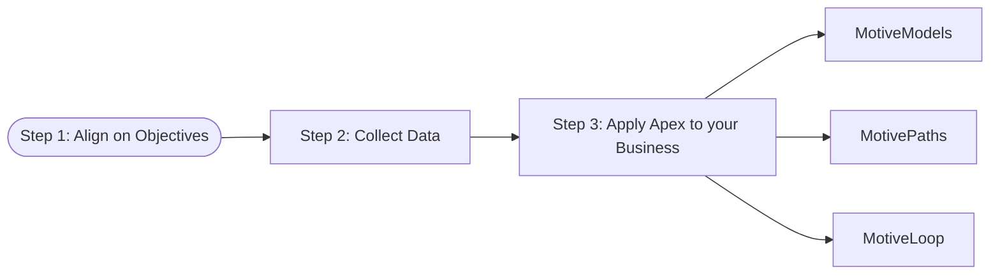

import {Motivator} from '/snippets/motivator.mdx';

Getting started with Apex is simple. We’ve built a streamlined process that ensures your time is well spent and your data is put to work immediately—no fluff, no guesswork.

## Quickstart Steps

<Steps>
<Step title="Align on Objectives">

We begin with a short onboarding session to understand your business goals. Whether it’s reducing churn, growing loyalty, or capturing a new segment, this informs how we tailor our models and plans.

- Share your primary business mandate
- Clarify key KPIs and target audiences
- Discuss relevant internal initiatives or timing constraints

</Step>
<Step title="Collect Data">

We field a short motivational survey to a defined audience segment. We use your existing data investments as inputs. We’ll guide you in gathering what’s helpful:

<Note>
We do not require PII.
</Note>

- Behavioral (e.g. web/app usage, purchases)
- Transactional (e.g. spend frequency, basket size)
- Demographic (e.g. age group, location, customer tier)
- CRM, survey, or social feedback (especially open-ended)
- Securely uploaded via portal or SFTP

</Step>
<Step title="Apply Apex to your Business">

Once data is gathered and your business priorities are clear, we employ three approaches to achieve your goals:

<ParamField path="MotiveModel">
For when you want to understand how to influence the advocacy and purchase behaviours of your key customer segments and their motivations.

Apex will generate custom **MotiveModels** which are behavioral-science-backed representations of what motivates your key customer segments to advocate and be loyal. 
</ParamField>

<ParamField path="MotivePath">
For when you need to achieve a specific business goal quickly and effectively and need a high-confidence, measurable intervention plan.

**MotiveModels**, while useful on their own for Marketers, Product Leaders, and Strategy Builders, can be focused to inform a specific business goal (such as reducing churn, improving upsell, winning a daypart or activating new customers for example) through **MotivePath**. **MotivePath** combines holistic motivational, behavioral, transactional, and demographic data to simulate and prescribe the most effective actions for your specific goals. 
</ParamField>

<ParamField path="MotiveLoop">
For when you want to embed our team and technology and continuously learn from new behavior, update motivator profiles, and track performance across segments to keep your strategies current, confident, and connected to what customers care about most as sentiment shifts.

**MotiveLoop** is an always-on intelligence layer that delivers recurring **MotiveModels** across your key customer segments and can generate **MotivePaths** quickly and effectively without the need for a full data refresh.
</ParamField>

</Step>
</Steps>

## Baseline Engagement Time Commitment

To provide an idea of the time commitment required from your organization/team, we've outlined a "cold-start", basic engagement plan below that would focus on building one or more **MotiveModels**, analyzing them, and reporting on the results as a one-time project.

- **Meet & Greet**: 15-30 minutes. [Contact us to schedule](https://apexscore.ai/contact)

Once we formally engage, over the course of a 3-4 week first-time delivery period, you can expect:

- **Alignment Meeting**: 60–90 minutes
- **Collect Data**: ~2 hours of collaboration
- **Review and Presentation Meetings**: 1–2 hours

Total: ~4-6 hours over 3-4 weeks from relevant stakeholders.

We do the heavy lifting. Your job is to bring the context and domain expertise.

## What You Don’t Need

- ❌ No PII or raw customer identity data is required
- ❌ No AI expertise or analytics team is required
- ❌ No new tech stack to integrate

## You're Ready When...

- ✅ You understand your business goals and objectives
- ✅ You’re open to grounding strategy in what people actually care about  

Let’s get to work.
